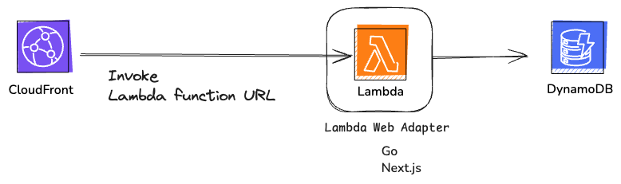

# designdoc

- cloudnative に組み直す
- メモ帳 + 音声認識 (Whisper API) + LLM (ChatGPT) のようなアプリへ

## Stacks
- DynamoDB
- CloudFront
- Lambda

## データ設計
- 検索用途ではないので、データ設計はあまり気にしていない
- Primary Key を Binder Name へ Sort Key を Note Name にすれば、ある程度耐えられると思う

## 構成図

